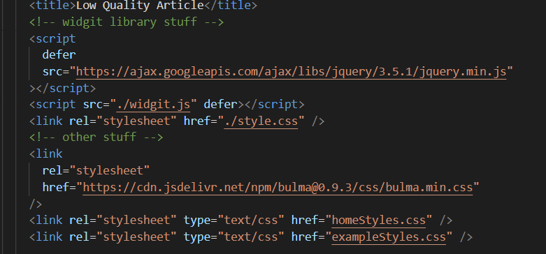
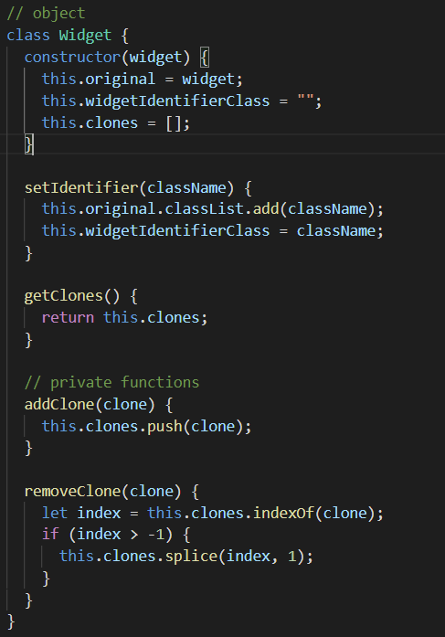

# js-library-lintao7

Heroku link: https://agile-river-90632.herokuapp.com/example.html

 <h4>Getting started</h4>

 The library requires the followings: Jquery, widgit.js (library code) and style.css (css file for the library). Make sure to have to Jquery script before the widigt.js script. 

 
<h4>Basic functionality</h4>

 First you want to call the <code style="display: inline">createWidget(element)</code>, which takes in the element in which you want the user to create widgets out of. The function will return an object of the widget, which will be used for setting the identifier. Afterwards the user should be able to create widgets out of said element.

<h4>Widget Object</h4>

